# PCAP Programming - TCP 패킷 파싱

## 1. 과제 개요

C/C++ PCAP API를 이용해서 패킷을 캡처하고, Ethernet / IP / TCP 헤더 정보와 HTTP 메세지를 파싱해서 출력하는 프로그램을 만드는 과제였다.

요구사항은 다음과 같다.

- Ethernet Header: Src MAC / Dst MAC
- IP Header: Src IP / Dst IP
- TCP Header: Src Port / Dst Port
- HTTP Message 출력
- TCP 프로토콜만 처리 (UDP는 무시)
- IP header, TCP header의 길이 정보(ip_header_len, tcp_header_len)를 반드시 활용해서 오프셋을 계산할 것

패킷은 Ethernet, IP, TCP 헤더가 순서대로 붙어 있는 구조였고, 이번 과제에서는 각 헤더를 차례대로 읽으면서 필요한 정보를 출력했다.

멘토님이 주신 `sniff_improved.c`, `myheader.h`를 참고해서 기본 코드를 사용했고, MAC 주소 출력과 HTTP 메세지 파싱 부분을 직접 구현했다.

**개발 환경**

- Ubuntu 24.04 (VMware 가상머신)
- 캡처 인터페이스: ens33
- libpcap 기반 (-lpcap)
- 트래픽 발생: 다른 터미널에서 curl http://example.com 실행

---

## 2. 기본 개념

MAC 주소는 같은 네트워크 안에서 장치를 구분하는 주소이고,
IP 주소는 인터넷에서 목적지 컴퓨터를 찾기 위한 주소이다.
Port는 하나의 컴퓨터 안에서 어떤 프로그램으로 데이터를 전달할지 구분하는 번호이다.

이번 과제에서는 `libpcap` 라이브러리를 이용해 패킷을 캡처했다. 사용한 함수들의 역할은 아래와 같다.

- `pcap_open_live()` : 지정한 인터페이스(`ens33`)에서 패킷을 캡처할 준비를 한다.
- `pcap_compile()` / `pcap_setfilter()` : 원하는 패킷만 캡처하도록 필터를 설정한다. 이번 과제에서는 `"tcp"` 필터를 사용했다.
- `pcap_loop()` : 패킷이 들어올 때마다 `got_packet()` 함수를 호출해 패킷을 처리한다.

---

## 3. 헤더 분석

멘토님 자료를 참고해서 세 가지 구조체를 그대로 사용했다.
Ethernet 헤더에는 목적지 MAC 주소와 출발지 MAC 주소가 저장되어 있고, 길이는 14바이트로 고정되어 있다.

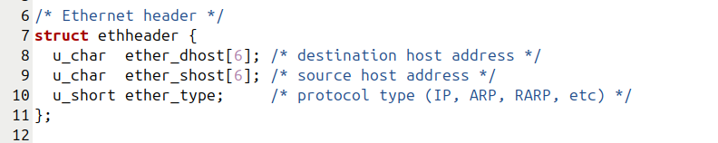
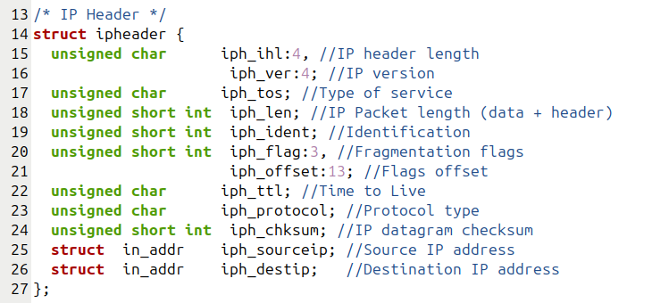
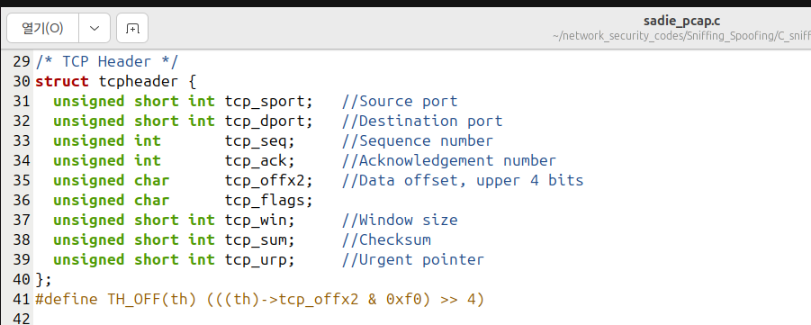

Ethernet 헤더는 길이가 14바이트로 고정이라 오프셋을 계산하기가 쉬웠다.
ether_type이 0x0800이면 IP 패킷이라는 뜻이라, 이걸로 먼저 걸러냈다.

iph_ihl은 처음에 그냥 바이트 수인 줄 알았다.
그런데 출력 결과가 계속 이상해서 찾아보니 4바이트 단위 값이었다.
그래서 iph_ihl * 4를 해주니 정상적으로 다음 헤더 위치를 찾을 수 있었다.
TCP도 같은 방식이었다. `TH_OFF()`로 길이 값을 구한 뒤 4를 곱해서 TCP 헤더 길이를 계산했다.

---

## 4. 구현하면서 겪은 것들

이번 과제에서는 Ethernet → IP → TCP 순서로 포인터를 이동시키면서 오프셋을 계산해 각 헤더 위치를 찾았다.

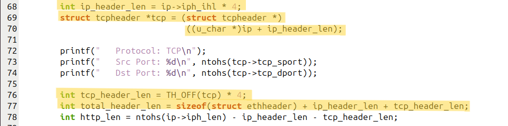

처음에는 IP 헤더가 항상 20바이트인 줄 알고 그 기준으로 오프셋을 계산했다.
그런데 과제를 하면서 `ip_header_len`을 이용해 실제 헤더 길이를 계산해야 한다는 것을 알게 됐다. 옵션이 있는 패킷은 헤더 길이가 더 길어질 수 있어서였다.

IP 전체 길이(`iph_len`)에서 IP 헤더와 TCP 헤더 길이를 빼서 HTTP 메시지(Payload) 길이를 계산했다.
이렇게 계산한 길이를 이용해서 HTTP 메시지만 출력했다. `http_len > 0`일 때만 출력하도록 해서, 데이터가 없는 SYN이나 ACK 패킷에서는 출력하지 않도록 했다.

포트 번호를 처음 출력했을 때 이상한 값이 나와서 한참 헤맸는데, `ntohs()`를 사용하지 않아서 생긴 문제였다. 네트워크에서 전달되는 값은 바이트 순서가 달라 변환이 필요하다는 것을 알게 됐고, `tcp_sport`, `tcp_dport`, `iph_len` 모두 `ntohs()`를 사용하도록 수정했다.

프로토콜은 `switch` 문을 사용해 아래와 같이 분기해서 처리했다. TCP 헤더 뒤의 Payload 부분이 HTTP Message가 된다.

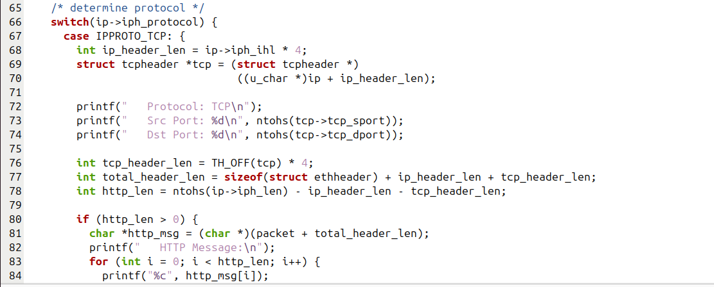

BPF 필터를 "tcp"로 걸어서 어차피 TCP만 들어오긴 하는데, 혹시 몰라서 UDP/ICMP/기타 케이스도 남겨뒀다.

---

## 5. 전체 소스 코드 (sadie_pcap.c)

전체 코드는 [sadie_pcap.c](./sadie_pcap.c) 파일 참고.

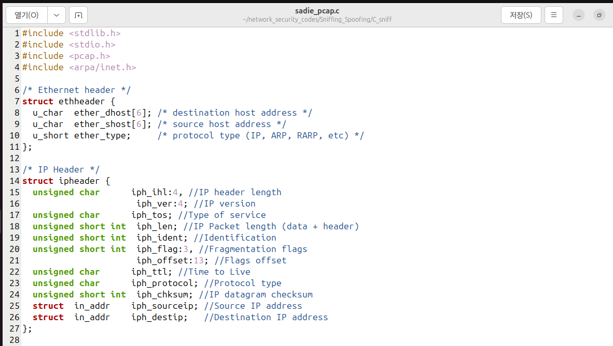
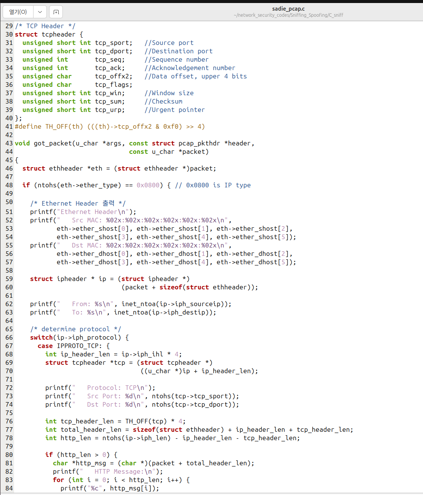
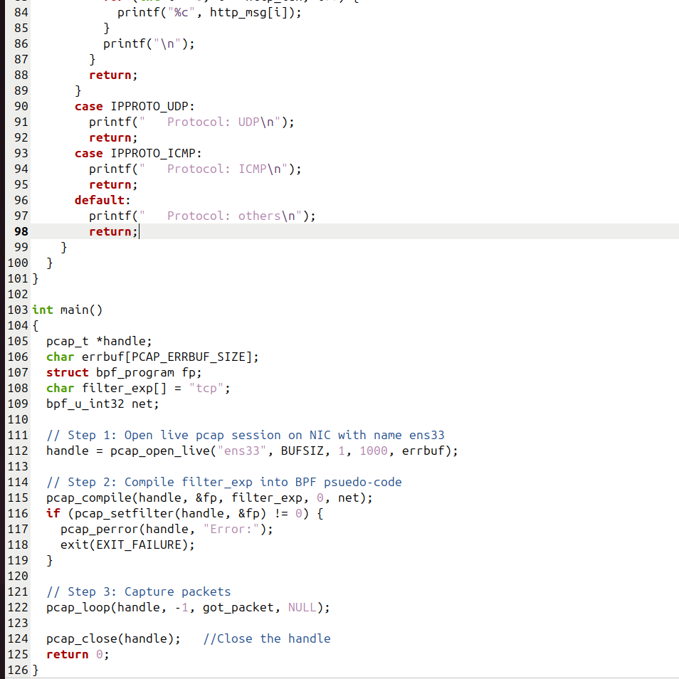

**컴파일 및 실행**

```bash
gcc sadie_pcap.c -o sadie_pcap -lpcap
sudo ./sadie_pcap
```

다른 터미널에서 트래픽 발생:

```bash
curl http://example.com
```

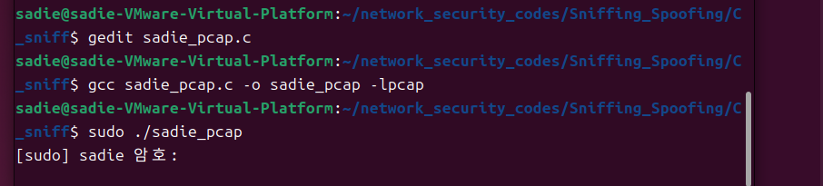
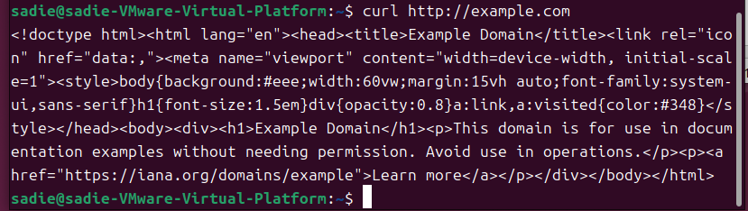

---

## 6. 실행 결과

curl http://example.com 으로 트래픽을 발생시켜서 캡처했더니 아래처럼 나왔다.

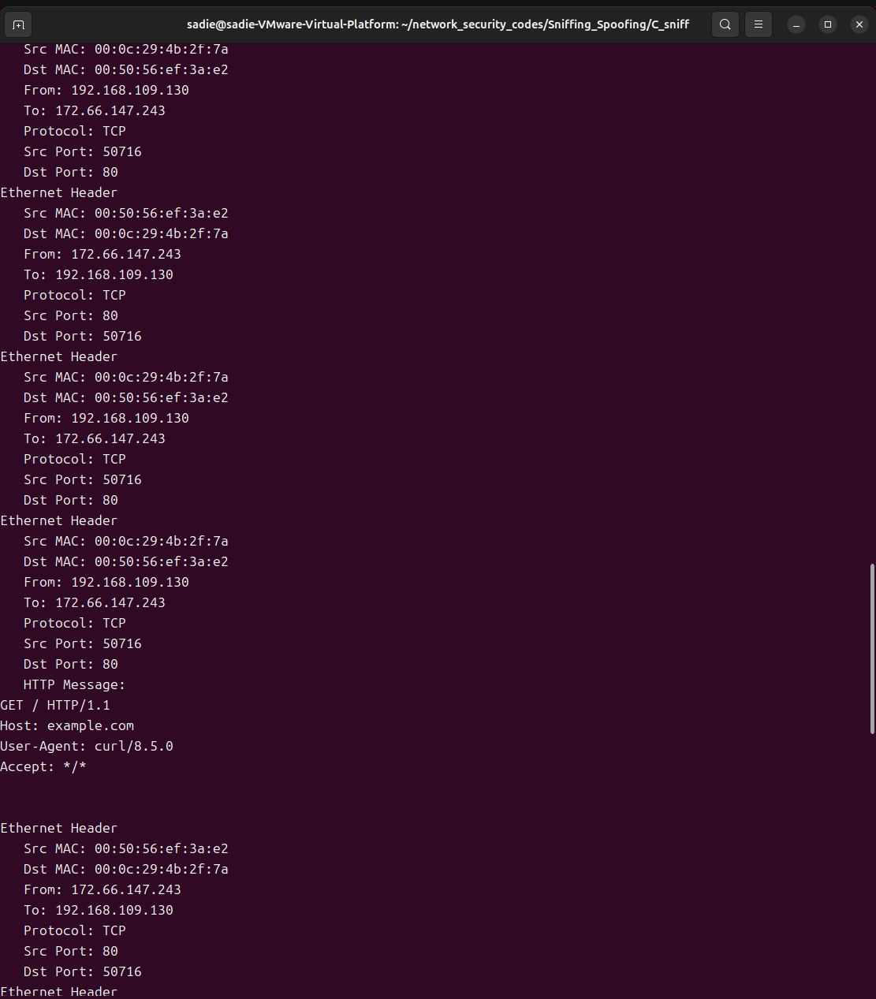

요청 패킷에서는 GET / HTTP/1.1이, 응답 패킷에서는 HTTP/1.1 200 OK가 나왔다.
요구사항대로 HTTP 요청과 응답 메세지가 잘 출력됐다.
방향이 바뀔 때마다 MAC 주소와 IP 주소의 송수신 정보가 반대로 출력되는 것을 확인했고, 이를 통해 오프셋 계산이 정상적으로 이루어졌음을 확인했다.

### 6-1. Wireshark로 확인해보기

프로그램이 제대로 동작하는지 확인하려고 같은 트래픽을 Wireshark로도 같이 캡처해봤다.
ens33에 tcp 필터 걸어서 잡은 화면이랑 내 프로그램 출력을 비교해보니 MAC, IP, Port, HTTP 메세지가 다 똑같이 나왔다.

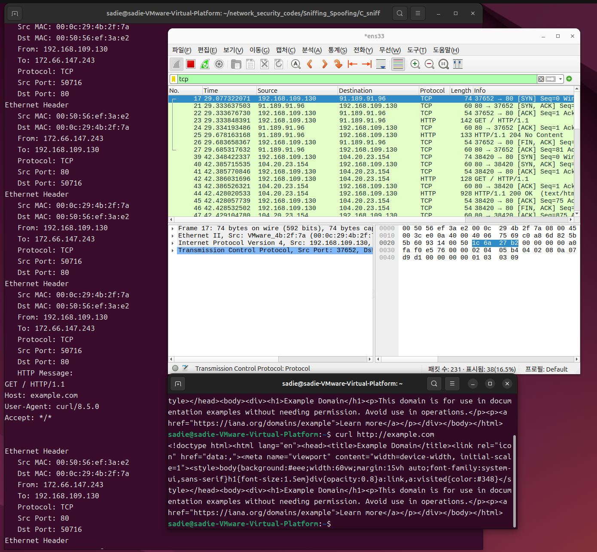

---

## 7. 헷갈렸던 부분 / 배운 점

- Ethernet Header의 MAC 주소 출력을 처음에 빠뜨렸다. 요구사항 다시 보고 %02x 포맷으로 6바이트 이어붙여서 추가했다.
- iph_ihl, tcp_offx2가 바이트 단위가 아니라 4바이트 단위 값이라는 걸 몰라서 처음엔 결과가 이상하게 나왔다. * 4를 해줘야 한다는 걸 알고 나서 해결됐다.
- 포트 번호가 이상하게 나와서 찾아보니 ntohs()를 안 거쳐서였다.
- bpf_u_int32 net을 `pcap_lookupnet()`으로 netmask를 초기화하지 않았는데도 `"tcp"` 필터는 정상적으로 동작했다.

이번 과제를 하면서 각 헤더가 메모리에서 어떻게 이어져 있는지 알게 됐고, 왜 길이 필드를 직접 읽어서 다음 헤더 위치를 계산해야 하는지도 이해했다. libpcap을 이용한 패킷 캡처 과정과 각 헤더가 어떻게 구성되어 있는지 직접 확인해볼 수 있었던 과제였다.
